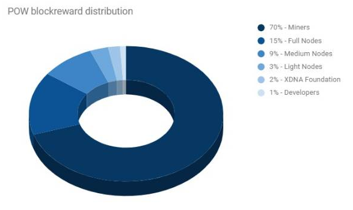

XDNA Core integration/staging repository
=====================================

XDNA is a brand new digital currency that combines all the positive aspects of successful digital currencies, while taking into account their flaws and weak points.
The project brings tangible benefits not only to the digital world but also to the real one.

More information at [xdna.io](https://xdna.io) Visit our ANN thread at [BitcoinTalk](https://bitcointalk.org/index.php?topic=4517612.0), join our group at [Discord] (https://discord.gg/S9adMgS).

### Coin Specs

<table>
<tr><td>Name & ticker</td><td>XDNA</td></tr>
<tr><td>Consensus algorithm</td><td>PoW/POS</td></tr>
<tr><td>POW phase duration</td><td>1440000 blocks</td></tr>
<tr><td>PoW block reward</td><td>Dynamic from 4 to 511 XDNA</td></tr>
<tr><td>Instamine protection</td><td>First 720 blocks</td></tr>
<tr><td>Hashing algorithm</td><td>HEX</td></tr>
<tr><td>Estimated XDNA supply during POW</td><td>138,000,000</td></tr>
<tr><td>POS starting block</td><td>1440001</td></tr>
<tr><td>POS phase duration</td><td>Unlimited</td></tr>
<tr><td>POS block reward</td><td>57 XDNA lowering by 4 coins every 525600 blocks until block reward is 1 XDNA</td></tr>
<tr><td>POS block reward distribution</td><td>SeeSaw</td></tr>
<tr><td>Estimated XDNA supply during 15 years of POS</td><td>228,000,000</td></tr>
<tr><td>Premine</td><td>971,712 XDNA (0.7% of POW total supply)</td></tr>
<tr><td>Blocksize</td><td>1 MB</td></tr>
<tr><td>Blocktime average</td><td>1 min (DGW3)</td></tr>
<tr><td>Number of transaction confirmations</td><td>6</td></tr>
<tr><td>Maturity</td><td>60 confirmations</td></tr>
</table>

### Block reward

<table>
<tr><th>Level</th><th>Network hashrate (Gh/s)</th><th>Block reward</th></tr>
<tr><th>1</th><th>10</th><th>4</th></tr>
<tr><th>2</th><th>20</th><th>5</th></tr>
<tr><th>3</th><th>30</th><th>7</th></tr>
<tr><th>4</th><th>50</th><th>10</th></tr>
<tr><th>5</th><th>80</th><th>14</th></tr>
<tr><th>6</th><th>130</th><th>19</th></tr>
<tr><th>7</th><th>210</th><th>25</th></tr>
<tr><th>8</th><th>340</th><th>32</th></tr>
<tr><th>9</th><th>550</th><th>40</th></tr>
<tr><th>10</th><th>890</th><th>49</th></tr>
<tr><th>11</th><th>1.440</th><th>59</th></tr>
<tr><th>12</th><th>2.330</th><th>70</th></tr>
<tr><th>13</th><th>3.770</th><th>82</th></tr>
<tr><th>14</th><th>6.100</th><th>95</th></tr>
<tr><th>15</th><th>9.870</th><th>109</th></tr>
</table>

